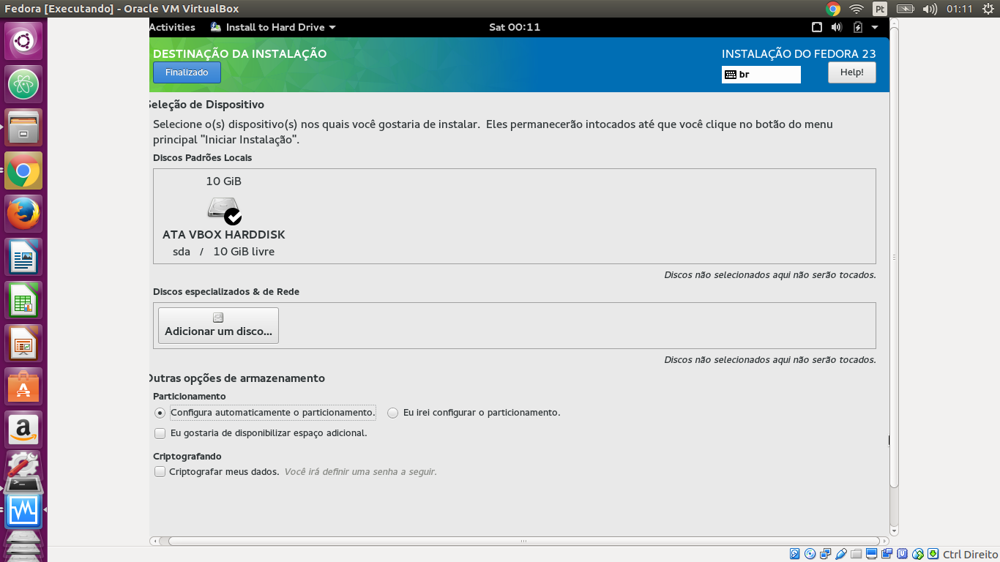

# Instalando o Fedora

## Download

Você pode baixar uma imagem do Fedora [aqui](https://getfedora.org/pt_BR/workstation)

## Instalação

### Selecione a opção "Start Fedora Live"

### Selecione a opção "Install to Hard Drive"

### Primeiramente escolha o idioma em que vai desejar realizar a instalação.

###Na tela "Resumo da Instalação", as 4 configurações seguintes pode ser feitas em qualquer ordem, diferentemente da instalação do Ubuntu que é mais linear. Podemos começar clicando em "Layout do Teclado".

### Nesta tela escolha o layout do teclado preferido e clique em "Finalizado".

###De volta à tela de "Resumo da Instalação", agora selecionamos a opção "Time & Date" para configurar data e hora do sistema. Escolha a região e cidade por caixa de seleção ou clicando no mapa e se deseja recuperar horário da rede e clique em "Finalizado".

### Agora escolha a opção "Destinação da Instalação", selecione o disco rígido onde será feito a instalação. Você poderá optar pelo particionamento automático, isto é, feito pelo instalador ou pelo manual. Quando terminar, clique em "Finalizado".

### De volta à tela "Resumo de Instalação", agora só falta clicar em "Network & Hostname" para configurar o nome da sua máquina na rede. Escolha o nome da sua máquina e clique em "Finalizado".

### Finalmente de volta à tela resumo de instalação, clique em "Iniciar instalação"

### Agora você deve configurar a senha do usuário "root" do seu sistema. Usuário "root" é aquele que pode alterar a configuração do sistema, configurar interfaces de rede, manipular usuários e grupos, alterar a prioridades de processos, entre outros. Leia mais em: [O usuário root](http://www.infowester.com/linroot.php)

### Digite a senha e a confirme e aperte em "Finalizado".

### Finalmente está na hora de criar um usuário para você no sistema. Digite seu nome completo e seu nome de usuário. Em seguida escolha se deseja transformar esse usuário em administrador do sistema e se é necessário uma senha para acessar essa conta, o que é recomendável. Em seguida aperte em "Finalizado".

### De volta à tela de "Configuração", aperte em "Finalizar a configuração" e aguarde alguns instantes.

### Pronto!! Agora aperte em "Sair" para começar a usar! :D

