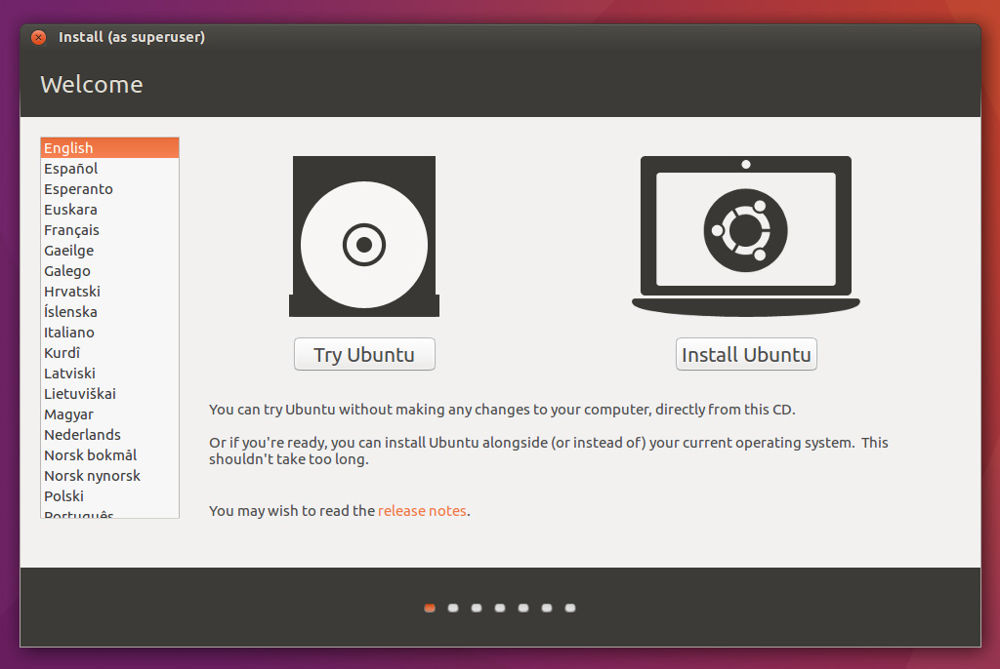
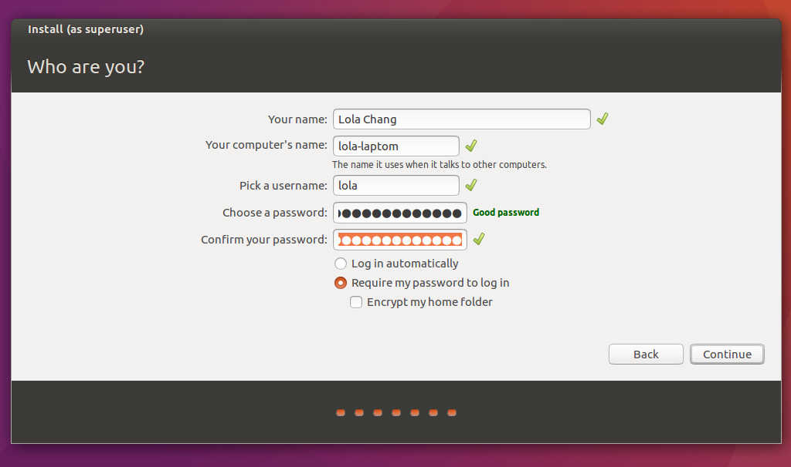

# Instalando o Ubuntu

## Download

Você pode baixar uma imagem do Ubuntu [aqui](http://www.ubuntu.com/download/desktop)

## Instalação

### Selecione a opção "Install Ubuntu"

### Deixe as duas checkboxes marcadas e prossiga

### Aqui temos que pensar em qual forma de instalação faremos. Caso seja nativa ou VirtualBox, selecione a primeira opção que indica que usaremos todo o disco. Caso a instalação seja em dual boot, selecione a opção "Something else"

### Dependendo do que você escolheu anteriormente, aqui você terá que indicar em qual partição deve instalar o Ubuntu. Se você estiver instalando em Dual Boot, tome o cuidado de escolher a partição que você criou anteriormente para tal.

### Selecione o local em que você está localizada.

### Selecione o layout de teclado do seu computador.

### Crie o seu login e senha.

### Agora é só esperar um pouquinho enquando o Ubuntu instala e baixa atualizações

### É isso! Você já pode começar a usar o Ubuntu! :)

Fonte: [http://www.ubuntu.com/download/desktop/install-ubuntu-desktop](http://www.ubuntu.com/download/desktop/install-ubuntu-desktop)