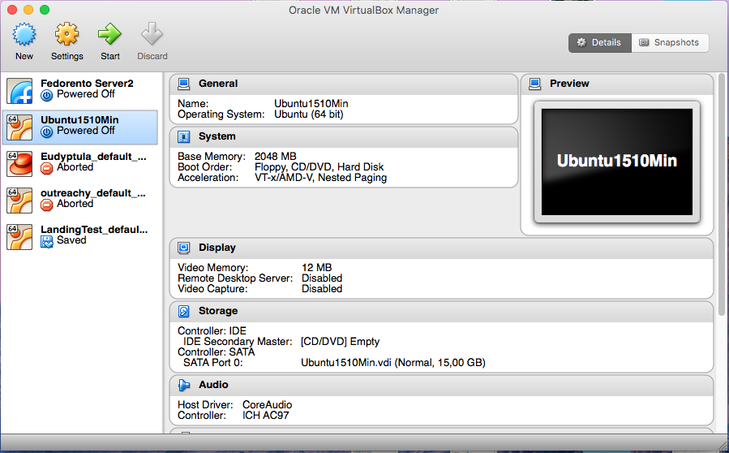
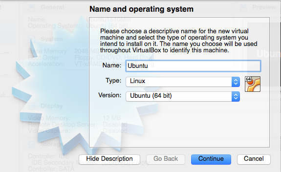
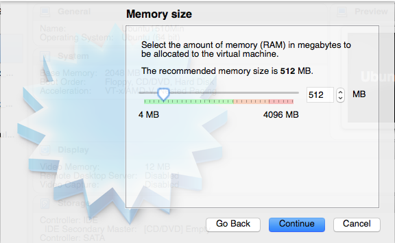
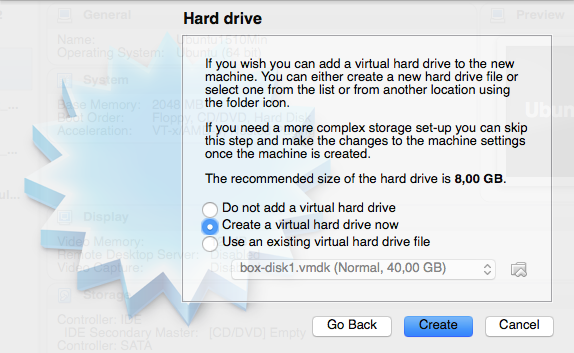
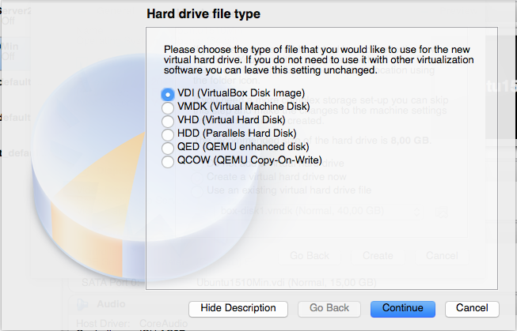
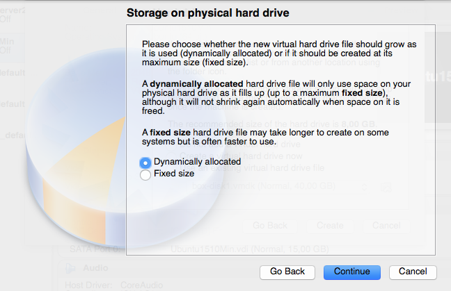
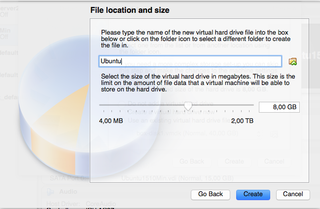
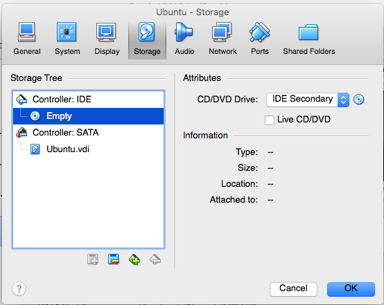
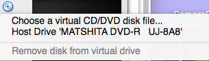

# Instalação em VirtualBox

## O quê é o Virtual Box?

O VirtualBox é uma ferramenta de virtualização. Ela permite que você rode uma máquina virtual dentro do seu sistema operacional. Imagine que você quer rodar o Linux dentro do seu Windows! É possível com o VirtualBox! O Linux pode funcionar dentro de uma janela do Windows, assim como os seus outros programas :)
É uma boa opção para quem quer conhecer o Linux sem fazer muitas alterações no seu computador. Caso mude de idéia, a máquina virtual com o Linux pode ser desinstalada assim como outros programas no seu computador.

## Como começar

Baixe o Virtual Box em [https://www.virtualbox.org/](https://www.virtualbox.org/) e inicie-o.
O próximo passo é conseguir uma imagem da distribuição desejada. Você pode baixar a imagem .iso no site da distribuição.

## Criando uma máquina virtual

### No VirtualBox, escolha a opção "New"

### Escreva um nome para a sua máquina virtual. Também escolha um tipo e uma versão.

### Escolha o tamanho da memória. Nesta tela, vamos deixar no padrão.

### Aqui, escolha "Create a virtual hard drive now".

### Selecione a opção "VDI".

### Selecione "Dinamically allocated".

### Tamanho do disco. Deixaremos no padrão sugerido pelo VirtualBox.

### Agora, clique com o botão direito no nome da sua máquina virtual recentemente criada e vá em Settings->Storage. Clique no CDzinho do lado esquerdo.

### Agora clique no CDzinho do lado direito. Se você tiver usando uma ISO baixada, selecione a primeira opção e selecione o seu arquivo. Se você estiver utilizando um LiveCD, selecione a segunda opção e não esqueça de marcar o checkbox "Live CD/DVD"

Siga para a parte do manual "Instalando o Ubuntu" ou "Instalando o Fedora".

