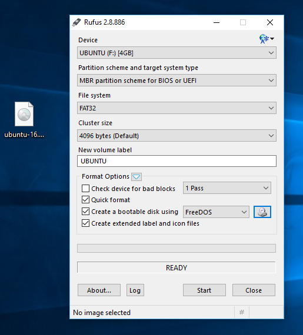
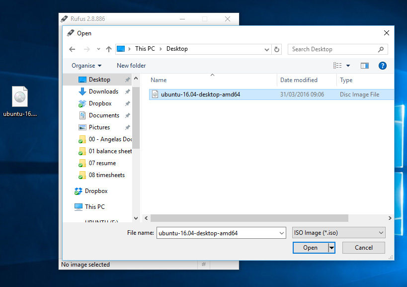
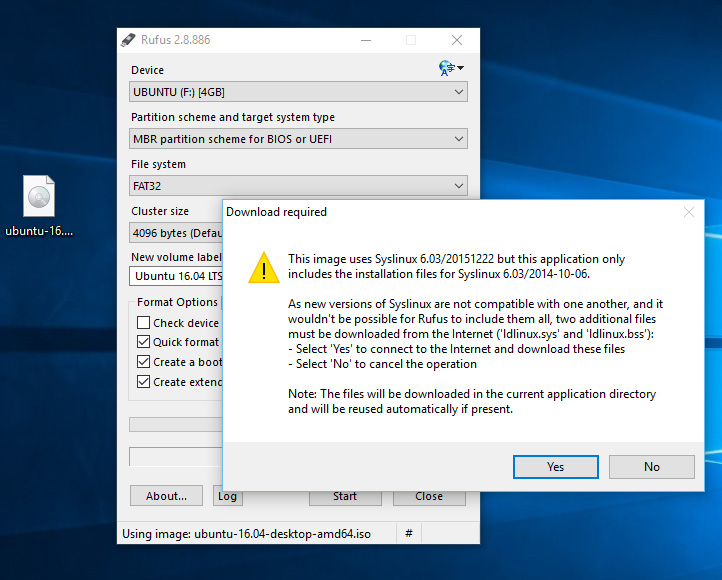
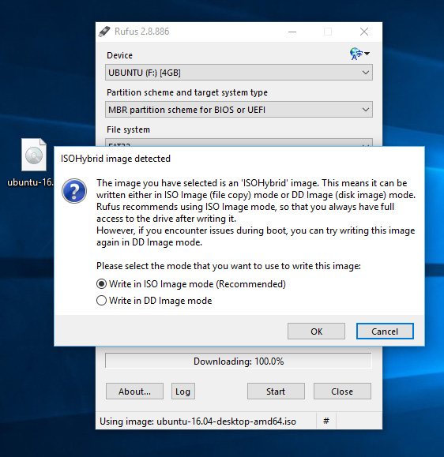
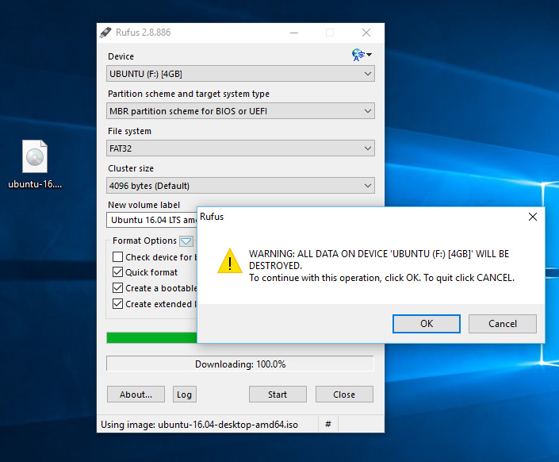
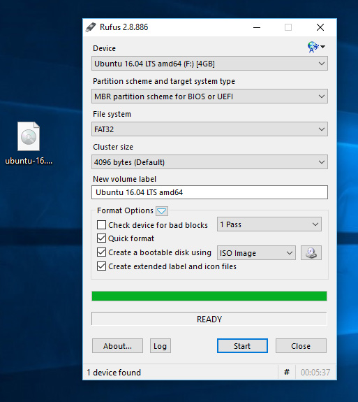

# Live USB Stick

Imagine que você comprou um jogo novo e ele veio em um CD para que você possa instalá-lo em seu computador. O Live USB Stick funciona de forma parecida. Nele gravamos a imagem do sistema operacional que queremos instalar. 

## Quando o Live USB Stick é necessário?

* Dual boot no Windows
* Instalação Nativa em Windows

Nos outros casos, apenas baixar a imagem é necessário.

Obs:  este manual não cobre instalação nativa em Macs.

## Onde conseguir a imagem?

Neste manual, cobriremos o Ubuntu e o Fedora. Você pode baixar a imagem nos seguintes links:

[Ubuntu](http://www.ubuntu.com/download/desktop)

[Fedora](https://getfedora.org/en/workstation/download/)

## Gravando a imagem no Pen Drive

### Windows

1) Baixe o Rufus [aqui](https://rufus.akeo.ie/)

2) Abra-o e selecione o seu pen drive no menu "Device"

3) Clique no ícone do CD próximo ao menu "FreeDOS", então encontre a imagem ISO baixada e clique em "Open"

4) Clique em "Yes" quando perguntar sobre baixar o Syslinux software

5) Clique em OK para "Write in ISO image mode" 

6) Confirme que o seu pendrive foi selecionado e OK para continuar

7) Seu Live USB Stick está pronto! :)

Fonte: [http://www.ubuntu.com/download/desktop/create-a-usb-stick-on-windows](http://www.ubuntu.com/download/desktop/create-a-usb-stick-on-windows)
